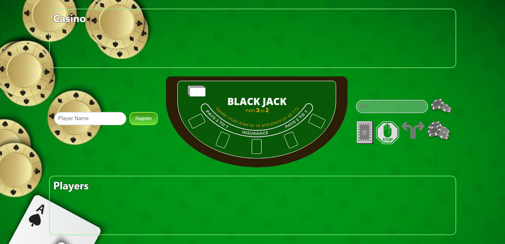
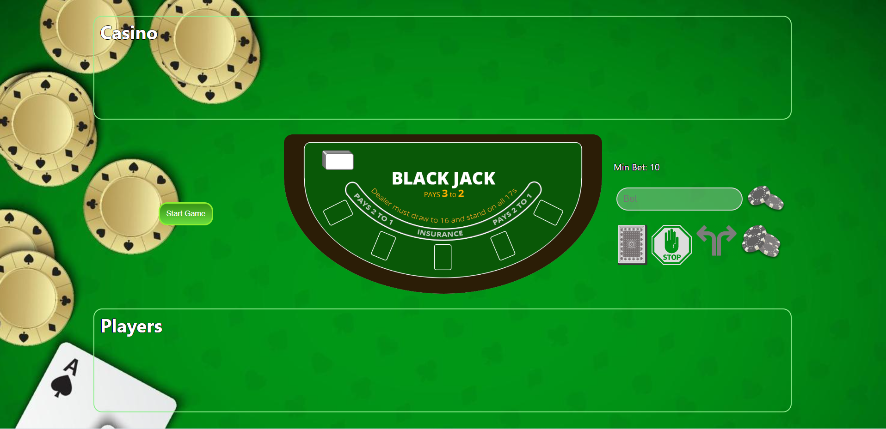
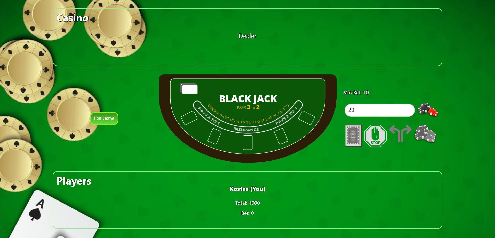
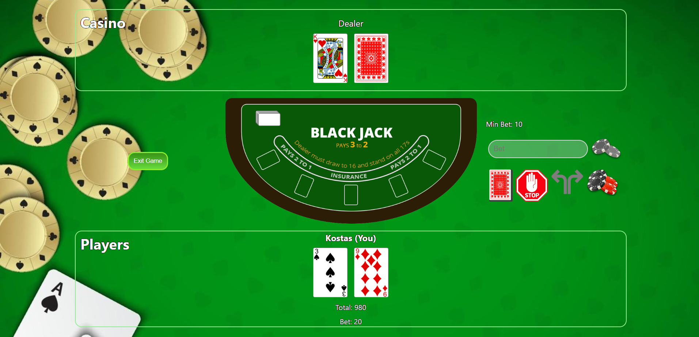
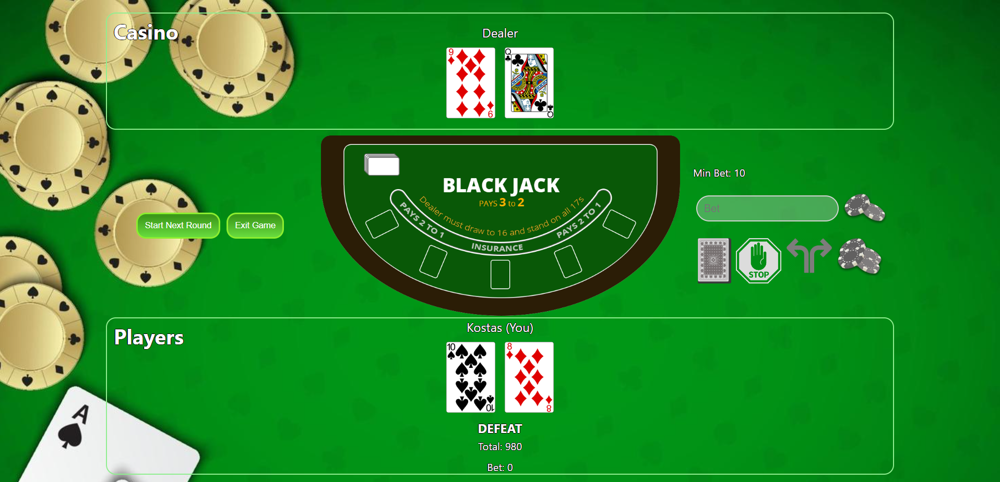
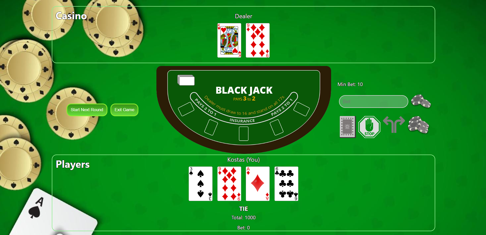
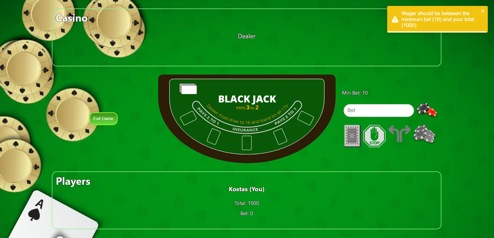
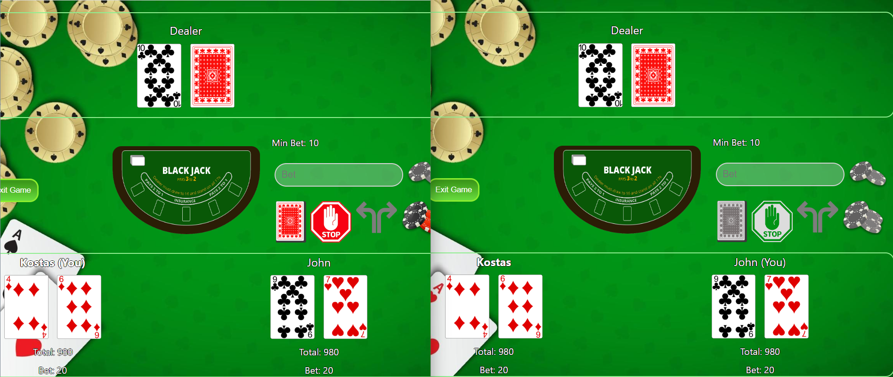

# The BlackJack App

A WebSocket implementation of the black-jack game.

## Supported Features

Player can:
 - Hit
 - Stand
 - Split
 - Double-down

Notes:
 - Black-Jack wins pay 3 : 2
 - Black-Jack
 - Surrender is not possible
 - Spliting aces is not allowed
 - The maximum bet is limited by the amount of money the player has

 Configurable:
 -  Number of decks: 6
 -  Minimum allowed bet: 10
 -  Initial amount of every player: 1000
 -  Dealer minimum stand score: 17

## Setup Instructions (development)

1. Clone the repository.
2. install node dependencies.

    ```
    cd server_app && npm i
    cd ..
    cd client_app && npm i 
    ```

3. Run the server and client applications by opening two terminal windows. For the server:
    ```
    cd server_app
    npm run dev
    ```
    and for the client:
    ```
    cd client_app
    npm start
    ```
### Tests

Tests are also implemented to validate the behavior of the game.

- To run all the tests you can run:

    ```
    npm test
    ```

 - for the unit tests only run:
    
    ```
    npm test:unit
    ```
-  and for the integration tests run:
    ```
    npm test:int
    ```

## Screenshots of the game
 
### Register your client when entering the app.


### Wait for other players to register as well and click the "Start Game" button to initiate a multiplayer game (or single player).


### Type the wager you want to bet


### Play the game


### Win


### Lose


### Tie


### Validation is also implemented to make sure correct input is given.


### Multiplayer game with two players.
