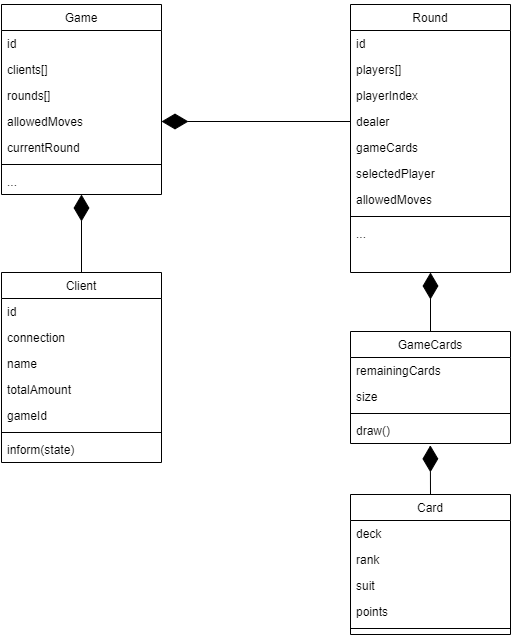

# The BlackJack App

A WebSocket implementation of the blackjack game using `Node.js`, `React.js` and `CSS`.
## Supported Features

About the app:
- Multiplayer
- Sounds in the UI
- Mobile friendly

Players can:
 - Bet 
 - Hit 
 - Stand 
 - Split 
 - Double-down 

Notes for this version of the game:
 - Black-Jack pays 3 : 2
 - Black-Jack beats 21
 - Surrender is not supported
 - Spliting aces is restricted
 - The maximum bet is limited by the amount of money the player has

 Configurable:
 -  Number of decks: 6
 -  Minimum allowed bet: 10
 -  Initial amount of every player: 1000

## How to play

1. Choose a name and click `Register`. 


2. You are redirected to the waiting room. When every player is ready (or just you) one of you must click `Start Game`.


3. Round has started! Every one should decide their wager. You cannot perform any action (apart from exiting the game by click the `Exit Game` button) until every player has bet.


4. It is the first player's turn! If it is you, you can choose to hit (draw a card), stand (stop and finish your turn), split (if possible) or double down. Otherwise, you need to wait for your turn.


5. After every player has played, you can see if the result is a `win`, a `defeat` or a `tie`.


6. To start another round with the same players click the `Start Next Round` button and play again.


7. You can also play in separate rooms. For example one player could exit the game and start the game while the others are already in a room. This will create a new room for that player while the others will continue playing together.
 

8. Finally, if you do something "unexpected", you will be notified with a toast notification message.


## Setup Instructions (development)

1. Clone the repository.
2. install node dependencies.

    ```
    cd server_app && npm i
    cd ..
    cd client_app && npm i 
    ```

3. Run the server and client applications by opening two terminal windows. For the server:
    ```
    cd server_app
    npm run dev
    ```
    and for the client:
    ```
    cd client_app
    npm start
    ```
### Tests

Tests are also implemented to validate the behavior of the game.

- To run all the tests you can run:

    ```
    npm test
    ```

 - for the unit tests only run:
    
    ```
    npm test:unit
    ```
-  and for the integration tests (not implemented yet) run:
    ```
    npm test:int
    ```

### Some notes about the architecture

The architecture is structured in a way that attempts to decouple the game/business logic from the delivery mechanism used to expose the game (WebSockets).

The idea is that the main file `index.js` creates a WebSocket server that uses the `ConnectionHandler` class to open a connection, handle input messages, or close a connection. The `ConnectionHandler` class then uses the `GameHandler` class to keep a list of all the games (either completed or active) and is responsible for forwarding commands to each `Game`. It must be noted that there are some commands that the user can instruct that are related to the `Game` (for example End-Game) and others that are related to a particular `Round` (for example Hit).


Each `Game` consists of multiple `Rounds` and serves multiple `Client`s. Furthermore, each `Round` must have one or more decks of `Card`s (`GameCards` class) that the `Dealer` will use to deal the `Card`s to the players.


In a `Round` we have two types of `Participant`s, the `Player`s and the `Dealer` which is unique in each game.


 A `Player` takes a `Client` object via Dependency Injection as each `Player` is assigned to one and only `Client`. However, a `Client` might belong to two `Player`s in case of split. In this case, two `Player` objects are used to manipulate the same `Client` object and transfer the amount of money that the player either won or lost.
 

* Note: In the class diagrams above the Composition symbol was used. In some cases (if not all) the Aggragation symbol would be more appropriate. However, our focus here is on the interactions between classes/objects to get a high level overview of the system.

 ### By Konstantinos Letros (kosletr)